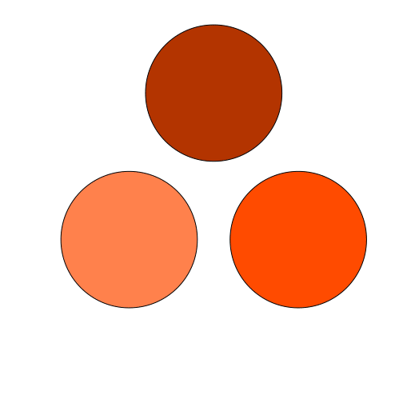

Run `julia-party-parrot.jl` to generate:

And then `crop.sh` shell script runs imagemagick commands to crop and alpha the white background:

Run `jp-swagger-in_phase.jl` to generate:

Run `jp-swagger-out_phase.jl` to generate:

